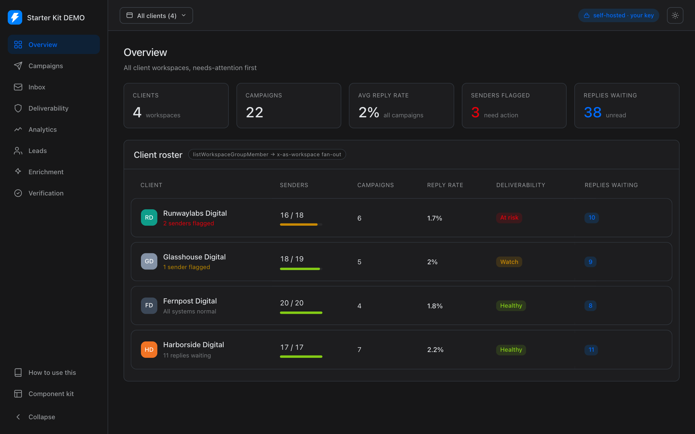
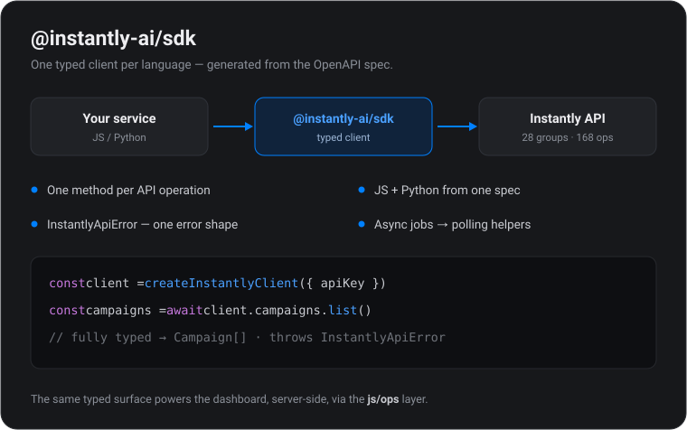
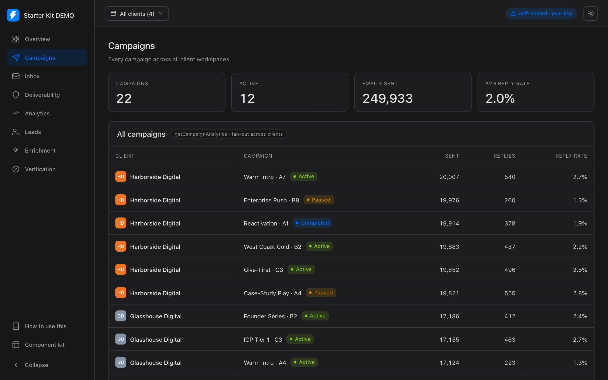
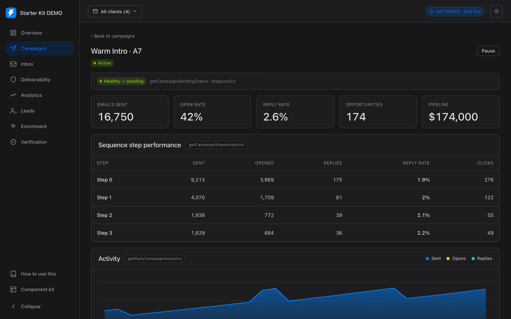
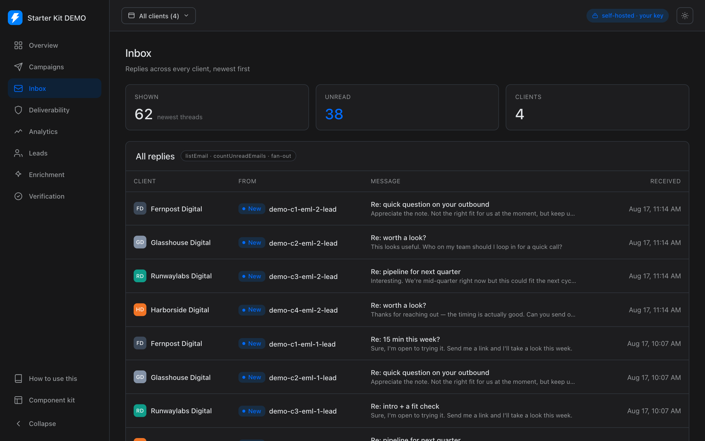
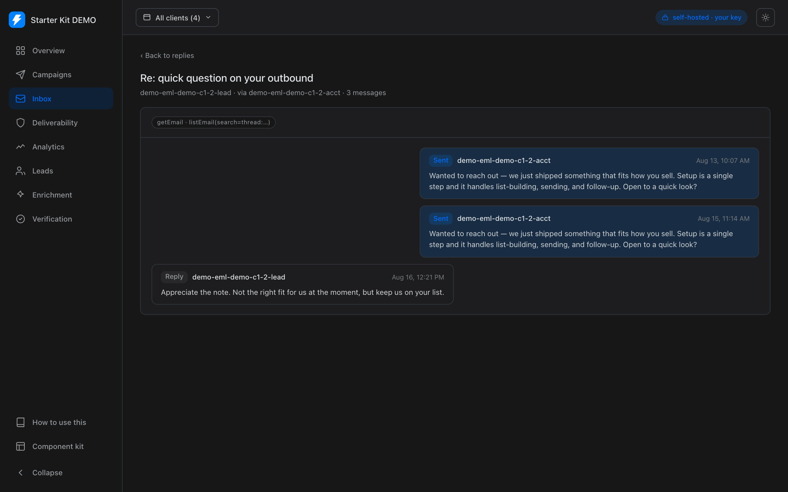
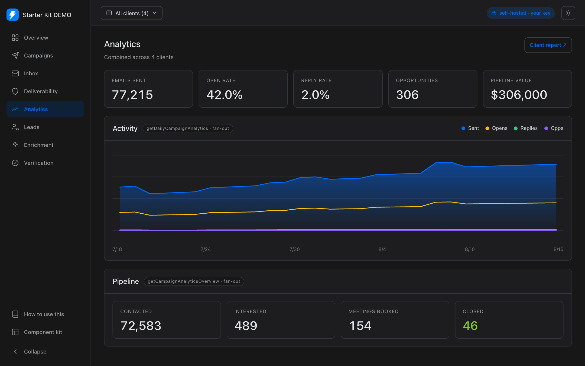
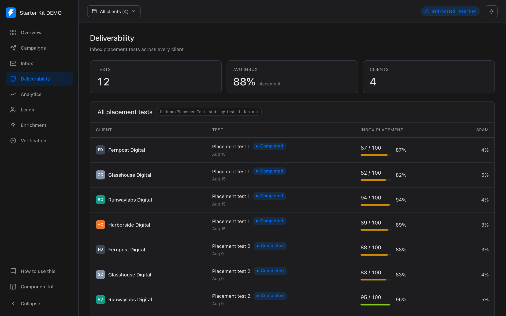

# Agency Console — the Instantly dashboard

A **self-hosted, whitelabel agency console** built on the Instantly SDK — and a
working reference for building your *own* service on the same typed SDK + domain core.

<table>
<tr>
<td width="50%" valign="top"><br><sub><b>The dashboard</b> — one pane over every client workspace.</sub></td>
<td width="50%" valign="top"><br><sub><b>The SDK it's built on</b> — typed, one method per operation.</sub></td>
</tr>
</table>

<p align="center">
  <a href="#quick-start">Quick start</a> ·
  <a href="#demo-mode--host-a-public-demo">Demo mode</a> ·
  <a href="#whitelabel-it">Whitelabel</a> ·
  <a href="#architecture">Architecture</a> ·
  <a href="#deploy">Deploy</a> ·
  <a href="REFERENCE.md">Reference</a>
</p>

**At a glance** &nbsp;·&nbsp; 🔑 key stays server-side &nbsp;·&nbsp; 🏢 fans out across client workspaces &nbsp;·&nbsp; 🎨 whitelabel in 3 env vars &nbsp;·&nbsp; 🧪 no-key demo mode &nbsp;·&nbsp; 🚫 no auth, no database

---

## What it is

Agencies and productized-outreach teams run outbound for many clients. This
console gives them **one pane over every client workspace**:

- With an **agency admin key** it auto-discovers your client sub-workspaces
  (`listWorkspaceGroupMember`) and fans out per client via `x-as-workspace`.
- With a **single-workspace key** it just shows your workspace.

It's deliberately thin: every number and action is a real Instantly SDK call,
routed through a small domain-core library (`js/ops`) so you can read exactly how
each surface is built and lift the pieces into your own product.

## See it

| Campaigns (agency-wide) | Campaign drill-down |
|---|---|
| [](core/public/docs/campaigns.png) | [](core/public/docs/campaign-detail.png) |
| **Agency inbox** | **Reply-thread drill-down** |
| [](core/public/docs/replies.png) | [](core/public/docs/thread.png) |
| **Analytics** | **Deliverability** |
| [](core/public/docs/analytics.png) | [](core/public/docs/deliverability.png) |

> Screenshots are the built-in **demo mode** (synthetic data — no real workspace).

## Quick start

```bash
cd js/dashboard/core
npm run setup                                     # builds the SDK + ops, then installs the app
echo "INSTANTLY_API_KEY=your_key_here" > .env     # read server-side only
npm run dev                                        # http://localhost:3000
```

That's it — no database, no migrations, no auth to configure. The key stays on
the server; the browser only ever sees rendered data.

> **Why `npm run setup` and not `npm install`?** The app depends on its monorepo
> siblings `@instantly-ai/sdk` and `@instantly-ai/ops`, and `ops` is built from
> `sdk` — so they must build in order (`sdk → ops → app`). `setup` does exactly
> that. It's a one-time step; after it, `npm run dev` / `build` work normally.

| Variable | What it does |
|---|---|
| `INSTANTLY_API_KEY` | **Required.** Your Instantly API key (server-side only). |
| `AS_WORKSPACE` | Optional. An admin-workspace id to act across client workspaces (agency mode). |
| `NEXT_PUBLIC_AGENCY_NAME` | Sidebar brand name (default "Agency Console"). |
| `NEXT_PUBLIC_ACCENT` | Accent colour — recolours the whole UI (default `#0080ff`). |
| `NEXT_PUBLIC_LOGO` | A logo in `public/` (drop your own there). |
| `NEXT_PUBLIC_DEMO` | `1` → run on synthetic data (see below). |

See [`core/.env.example`](core/.env.example).

## Demo mode — host a public demo

Set `NEXT_PUBLIC_DEMO=1`:

- **With no API key** → the whole app runs on **synthetic fixtures**. Nothing
  hits Instantly. This is how you host a public demo where visitors can explore
  every surface and learn the build patterns without seeing any real data.
- **With a key** → real data, but prospect PII (emails, names) is masked — handy
  for screen-shares and screenshots.

```bash
NEXT_PUBLIC_DEMO=1 npm run dev     # no key needed
```

## Whitelabel it

The whole UI is driven by CSS variables in
[`core/config/tokens.css`](core/config/tokens.css) — a rebrand is one file.
For the common case, three env vars are enough:

```bash
NEXT_PUBLIC_AGENCY_NAME="Meridian Outbound"
NEXT_PUBLIC_ACCENT="#7c5cff"     # recolours buttons, links, active nav, charts
NEXT_PUBLIC_LOGO="/logo.png"     # drop your file in core/public/
```

The design language follows the Instantly product app (dark-first, softened
foreground, hairline borders, `rounded-md` status chips, metric-led layout). It
ships light + dark, and the sidebar collapses.

## Architecture

Three layers, each doing one job:

```
@instantly-ai/sdk      typed client, one method per API operation
      ↓
js/ops  (@instantly-ai/ops)   domain core — reads, rollups, workflows,
                              agency fan-out, demo fixtures, job polling
      ↓
js/dashboard/core             Next.js App Router UI (server components +
                              server actions) — the only layer with JSX
```

- **All Instantly calls happen server-side** (`js/ops` is server-only). The UI
  imports `js/ops`, never the SDK or `fetch` directly.
- **Reads** render in async server components; **writes** go through server
  actions and are **confirm-gated** in the UI (nothing fires without an explicit
  Yes).
- The conventions the kit cares about are enforced here: **create-inactive →
  activate** for campaigns, **verify-before-send**, **async jobs are polled**
  (`awaitJob`), never faked as synchronous.

Full walkthrough — architecture, every page, the SDK read/write patterns, demo
mode internals, and how to extend it — is in **[REFERENCE.md](REFERENCE.md)** and
in the app itself under **Learn** (the book icon in the rail, `/learn`).

## What's inside

**Agency-wide pages:** Overview (client roster + headline stats), Campaigns,
Inbox, Deliverability, Analytics, Leads, Enrichment, Verification — each fans out
across clients and drills into per-item detail (a campaign, a reply thread).

**Per-client view** (`/client/[id]`): the same modules scoped to one workspace.

**Build-stack extras** (patterns to build *on*, not Instantly features
re-implemented):

- A **webhook receiver** reference (`app/api/webhooks/instantly/route.ts`) with a
  typed `parseWebhook`.
- **CSV lead import** — drag-drop modal with column mapping, preview, and a
  confirm-gated run into a chosen workspace.
- **CSV / PDF reports** (`/report`).
- **`awaitJob`** — a generic poller for async operations (verification,
  enrichment, bulk moves, warmup).

**Component kit** (`/kit`): every primitive on one page, for building new screens
in the same language.

## Deploy

The app depends on its monorepo siblings — `@instantly-ai/sdk` (`file:../../sdk`)
and `@instantly-ai/ops` (`file:../../ops`) — whose `prepare` scripts build on
install. So from a clone of this repo it just works:

```bash
cd js/dashboard/core
npm run setup                      # builds the SDK + ops (in order), then installs
npm run build && npm start         # or deploy to Vercel/Fly/a container
```

Set `INSTANTLY_API_KEY` (and any whitelabel vars) in the host's environment. Most
hosts (Vercel included) can deploy this subdirectory of the monorepo directly, so
the siblings are present at build time — point the install/build command at
`npm run setup && npm run build`.

**Deploying only this folder, outside the repo?** Vendor the two packages in
first, then point the deps at them:

```bash
npm run vendor                     # builds + copies sdk/ops into ./vendor (gitignored)
# then set both @instantly-ai/* deps in package.json to file:vendor/ops and file:vendor/sdk
```

## Extending it

Add a surface the same way the existing ones are built:

1. Add a read/rollup to `js/ops` (ground every call in a real SDK operation).
2. Render it in an async server component under `core/app` or `core/modules`.
3. For writes, add a server action and gate it with `<ConfirmAction>`.
4. Reuse the primitives in `core/components` (see `/kit`).

See **[REFERENCE.md](REFERENCE.md)** for the module map and the exact SDK
operations behind each surface.

---

Part of the [Instantly Starter Kit](../../README.md). Built with the
`instantly-ui` design language.
